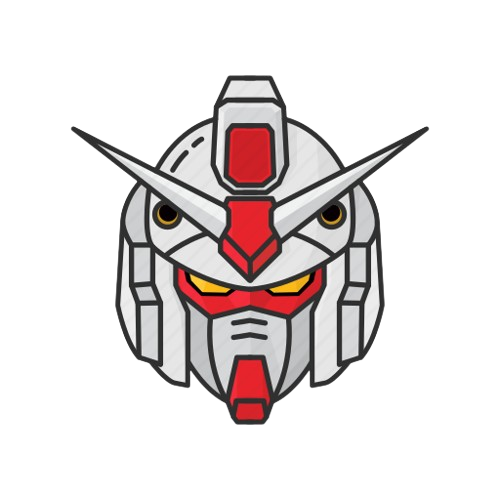

<!DOCTYPE html>
<html lang="en">
<head>
  <meta charset="UTF-8" />
  <meta name="viewport" content="width=device-width, initial-scale=1.0" />
  <title>WD Seatwork 1 - Clark Jacob P. Llamoso</title>
  <link rel="stylesheet" href="assets/css/style.css" />
  
</head>
<body>

  <header>
    <nav>
      <ul>
        <li><a href="#">Home</a></li>
        <li><a href="#">About</a></li>
        <li><a href="#">Contact</a></li>
      </ul>
    </nav>
  </header>

  <main>
    <section class="box box1">
      
      <h1>Clark Jacob P. Llamoso</h1>
      
TC05 - WD Seatwork 1

    </section>

    <section class="box box2">
      
      <h1>Red Zaku</h1>
    </section>

    <section class="box box3">
      
      <h1>Green Zaku</h1>
    </section>

    <section class="box box4">
      
      <h1>Earth Federation</h1>
    </section>

    <section class="box box5">
      
      <h1>Principality of Zeon</h1>
    </section>
  </main>

  <footer>
    
All Rights Reserved 2025

  </footer>

</body>
</html>
